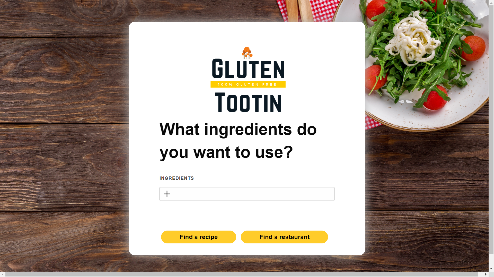
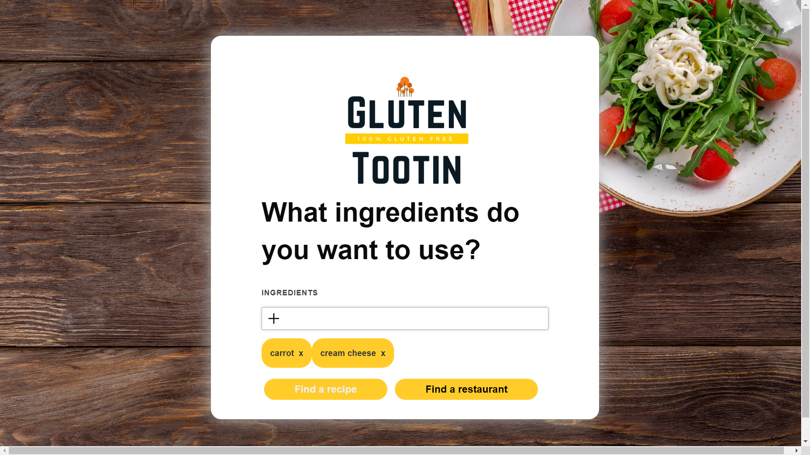
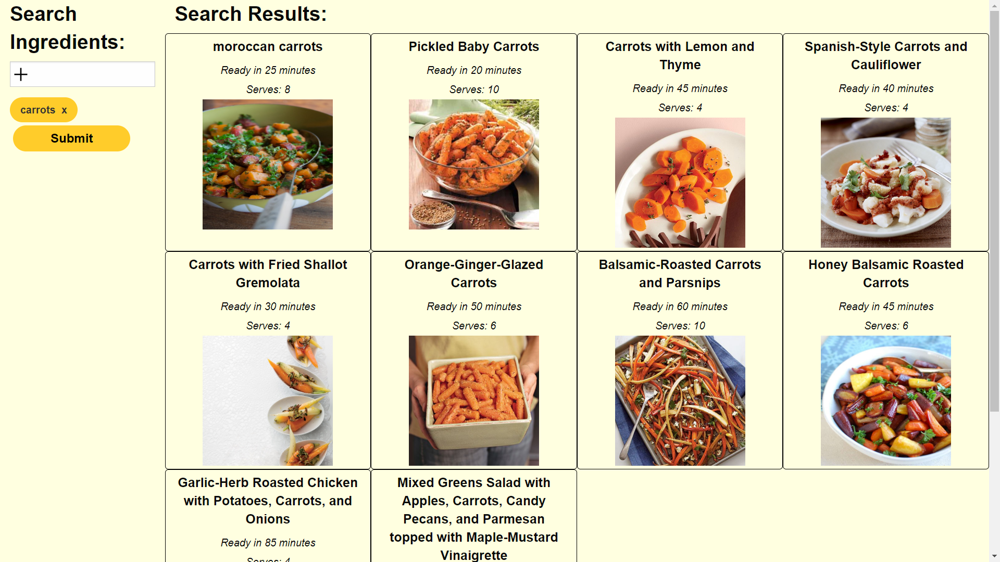
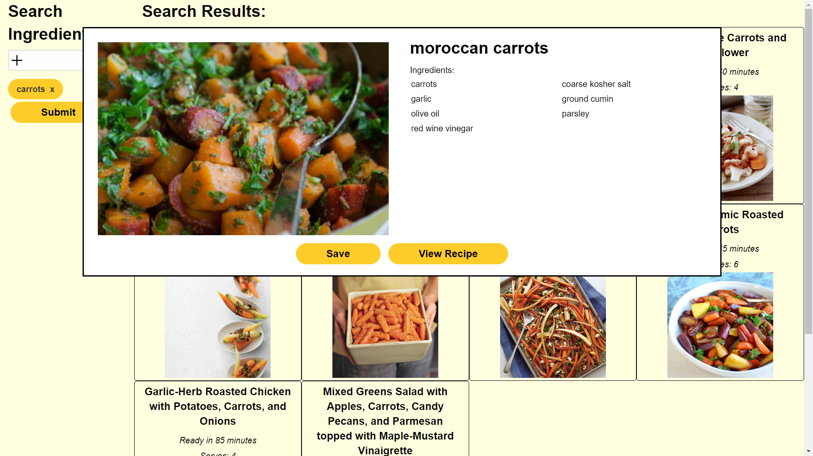
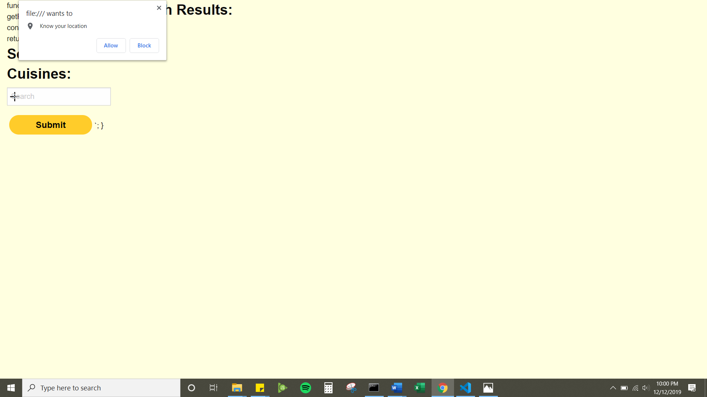

# Gluten Tootin
#### Making gluten free choices easy!

## Concept
This is an app for searching for gluten-free recipes and restaurants.

We developed this app for users to search for gluten-free recipes, and also provide a list of restaurants with similar gluten-free options.

As a person with certain dieting restrictions, I want to be able to search for food that fits into my diet plan, so that I won’t eat food that is potentially harmful.

## Tech Utilized
#### Languages: 
* HTML
* CSS
* Javascript & jQuery

#### APIs used:
* [Spoonacular](https://spoonacular.com/food-api)
* [Zomato](https://developers.zomato.com/api/v2.1/)

## Collaborators
#### Lead developer: 
Dan Dismuke
GitHub: [GuyFromHere](https://github.com/GuyFromHere)
#### Lead Designer: 
Adam Wheeler
GitHub: [adamwheeler81](https://github.com/adamwheeler81)
#### Lead Administrator: 
Laurie Schroeder
GitHub: [clauries](https://github.com/clauries)

## How to Use

## Challenges
* **Finding Our Roles**: This was the first time any of us had worked together. We are all very curteous, kind people who do not want to step on anyone else's toes. It took some time to settle into our specific roles. 
* **GitHub**: We had a steep learning curve with GitHub projects, issues, branching, and merging. None of us had used these aspects of GitHub before. Between the learning curve and Thanksgiving break in between learning the features and actually using them, we wasted a lot of time messing with GitHub. 
* **Working with Other People's Code**: We were learning when we needed to merge branches so no one was using wrong code. We were learning how each other's code looked and how we labled things. We were figuring out each other's logic and learning how to leave detailed notes so others could follow our paths. 

## Successes
* **Minimal HTML**: Dan figured out how to create templates using JS. This meant we did not have to load much code when the page opens. Instead we dynamically write the code as needed. 
* **Cohesive Look**: Adam created a logo and styled the website. No matter the section you are in, you feel the cohesiveness of the product. Additionally, the style is on trend with a modern and clean look.
* **Consistent Coding**: Although three people collaborated on the code, we worked hard to keep our coding similar by using similar naming practices, developing templates, and learning how others were coding similar pieces of code.

## Directions for Future Development
* **Profile to Save Favorites**: Currently the save function does not work. We would love to develop a system that creates a user profile. This profile will have a place where favorite recipes & restaurants can be saved. 

* **Email Recipes**: Provide users the opportunity to e-mail a recipe to self in case they want to use the recipe outside the app. 

* **More Search Options**: Develop more ways to search for recipes & restaurants. There are various ways to search through the APIs. For this project, we chose to stick to simpler options. It would be great to provide users with multiple routes to get a recipe or list of restaurants.

* **Search for Stores**: Expand app to search for stores that sell gluten-free items. This will probably require an additional API.

* **Add Rating System**: Develop a rating system for restaurants & stores to help other users know how gluten-free-friendly a location actually is. For example: are there only a couple options on the menu and there could be cross-contamination? Or is the entire establishment gluten-free?

